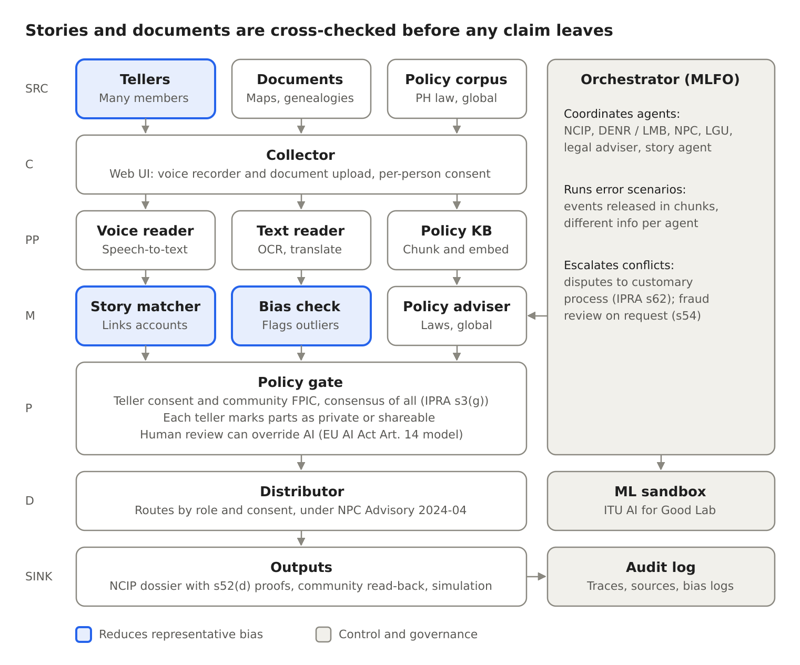

# Ancestral Land Story Pipeline

AI for Good Sandbox Hackathon (ITU AI for Good Lab, UAE) · Public services: ancestral land rights · Philippines

Team: Paul Alvarez, Kahlil de Silva · Repository: https://github.com/pwdrkg/ITUAIIP

An AI pipeline that helps indigenous communities prove ancestral land claims. It records stories from many members, not only appointed representatives. It also reads their documents and matches the accounts, flags one-sided claims for human review, and reads the consensus story back to the community. Institutional AI agents (NCIP, DENR, NPC, LGU, legal adviser) test it against step-by-step error scenarios. Every decision is logged with its sources and reasoning.



## Repository layout

| Folder | What it holds | Y.3172 stage |
| --- | --- | --- |
| `knowledge_base/` | Verified source list, downloaded documents, retrieval test | SRC (policy corpus) |
| `knowledge_base/private_store/` | Community recordings and documents. **Never committed or published** | SRC (community) |
| `pipeline/collector/` | Web and phone recorder, document upload, consent | C |
| `pipeline/preprocessor/` | Voice reader (speech-to-text), text reader (OCR), translation, entity extraction | PP |
| `pipeline/models/` | Story matcher, bias check | M |
| `pipeline/policy/` | Consent gate, private/shareable marks, human review | P |
| `pipeline/distributor/` | Role- and consent-based routing | D |
| `pipeline/sink/` | Read-back, sample dossier | SINK |
| `agents/` | Institutional agents and their mandates | M (orchestrated) |
| `scenarios/` | Error scenarios with events released over simulated days | Orchestrator |
| `audit/` | Audit log schema (hash-chained) | Audit |
| `app/` | Web interface | C / SINK |
| `scripts/` | Fetch, ingest and retrieval-test scripts | |
| `docs/` | Concept paper, technical report, full report, diagram | |

## Build the knowledge base

Requires Python 3.10+, git, and [Ollama](https://ollama.com) running with `ollama pull nomic-embed-text`.

```bash
bash scripts/setup_kb.sh            # clone ITU code, download sources, ingest, test
```

Or step by step:

```bash
git clone https://github.com/CrashingGuru/ITUAIReadiness.git ../ITUAIReadiness
pip install -r requirements.txt -r ../ITUAIReadiness/simulation/requirements.txt
python scripts/fetch_sources.py                     # downloads into knowledge_base/InputDocs/
python scripts/ingest_ph.py --itu-dir ../ITUAIReadiness
python scripts/run_retrieval_tests.py --itu-dir ../ITUAIReadiness
```

One source (the IP Code, `PH-L04`) must be downloaded by hand; the fetch script prints instructions.

## Knowledge base

50 sources are listed in [`knowledge_base/SOURCES.md`](knowledge_base/SOURCES.md), each with its URL, the date it was checked, and how the solution uses it. Curated files add 25 key clauses (16 verbatim), 16 key figures and 13 policy gaps linked to global examples, each stored as its own chunk for exact citation. See [`knowledge_base/README.md`](knowledge_base/README.md). Philippine government works are not covered by copyright (IP Code s176), so the Philippine laws and rules can be published in the open knowledge base. Check the licence of each global-practice document before publishing it; community data is never published.

## Status

- [x] Concept, architecture, scenario and audit design
- [x] Verified source list, fetch, ingest and retrieval-test scripts
- [ ] Run ingestion and pass the retrieval test
- [ ] Agents and orchestrator
- [ ] Speech-to-text and entity-extraction fine-tunes
- [ ] Web interface
- [ ] End-to-end run of `scenarios/mining_overlap.yaml` with audit log
- [ ] Demo video (if shortlisted)

Key dates: registration 21 October 2026 · submission 10 November 2026.
